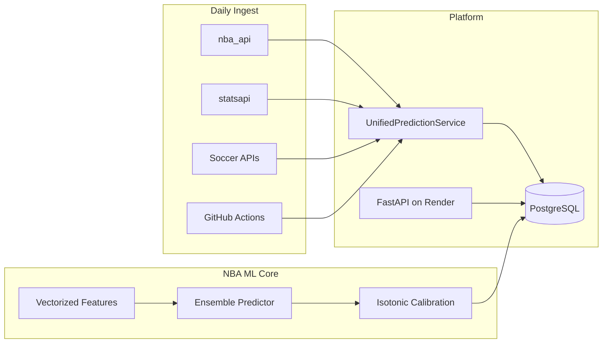

# Sports Analytics Platform

A multi-sport machine learning and analyst-feedback platform for **NBA**, **MLB**, and **FIFA/soccer**. The system ingests live schedules, stores unified predictions in PostgreSQL, runs automated daily sync via GitHub Actions, and serves a sport-aware review dashboard on Render.

**GitHub:** [Quintinlf/Sports-Analytics](https://github.com/Quintinlf/Sports-Analytics)

---

## What It Does

| Layer | Description |
|-------|-------------|
| **Live ingestion** | Daily pull of upcoming games from `nba_api`, MLB `statsapi`, and soccer APIs into one `predictions` table |
| **ML prediction** | NBA uses a 4-model ensemble (GP + LightGBM + Elo) with 17 leakage-safe features; MLB/FIFA use sport-specific schemas via `data/sport_config.py` |
| **Analyst feedback** | FastAPI web app with per-sport review forms, outcome tracking, and weekly email digests |
| **Automation** | GitHub Actions cron for prediction sync and reviewer emails; Render hosts the production API |



---

## Sports Coverage

| Sport | Data source | Outcomes | Model approach | Maturity |
|-------|-------------|----------|----------------|----------|
| **NBA** | `nba_api` | Home / Away win | GP + LightGBM quantile + LightGBM win + Elo ensemble | **Production ML** — full training, backtesting, calibration |
| **MLB** | `MLB-StatsAPI` | Home / Away win | Elo + XGBoost (configured in `sport_config.py`) | **Live ingestion** + sport-specific feedback |
| **FIFA** | Soccer fixture APIs | Home / Draw / Away | XGBoost multiclass + Elo (configured) | **Live ingestion** + sport-specific feedback |

Sport-specific features, email labels, feedback categories, and outcome types are centralized in `data/sport_config.py` — no hardcoded sport logic scattered across the codebase.

---

## Production Stack

| Component | Technology |
|-----------|------------|
| Web API | FastAPI + Uvicorn (`backend/main.py`) |
| Database | PostgreSQL on Render (SQLite for local dev) |
| Hosting | [Render](https://render.com) — see [`RENDER_DEPLOYMENT.md`](RENDER_DEPLOYMENT.md) |
| CI/CD | GitHub Actions — daily predictions + weekly reviewer digests |
| ML tracking | MLflow (`basketball/mlruns/`) |
| Email | SMTP (Gmail) weekly feedback forms |

### GitHub Actions workflows

| Workflow | Schedule | Purpose |
|----------|----------|---------|
| `daily-predictions.yml` | Daily 00:00 UTC | Ingest NBA / MLB / FIFA predictions into DB |
| `weekly-feedback.yml` | Sunday 00:00 UTC | Send personalized reviewer digest emails |
| `weekly-feedback-test.yml` | Manual | Test digest to a single reviewer |

---

## Quick Start

### 1. Clone and install

```bash
git clone https://github.com/Quintinlf/Sports-Analytics.git
cd Sports-Analytics

# Full ML + notebook environment
pip install -r requirements.txt

# Web API only (matches Render build)
pip install -r requirements-web.txt

# GitHub Actions / cron scripts
pip install -r requirements-automation.txt
```

### 2. Configure environment

Copy `.env.example` to `.env` and set at minimum:

```bash
DATABASE_URL=sqlite:///./sports_analytics.db   # local
FEEDBACK_BASE_URL=http://localhost:8000        # local
```

For production, see [`RENDER_DEPLOYMENT.md`](RENDER_DEPLOYMENT.md).

### 3. Run locally

```bash
# Start the feedback dashboard + API
uvicorn backend.main:app --reload --port 8000
# → http://localhost:8000/feedback

# Dry-run daily prediction ingest (no DB writes)
python scripts/cron_daily_predictions.py --dry-run

# Run live ingest
python scripts/cron_daily_predictions.py

# Verify component imports
python machine_learning/test_system.py

# Run unit tests
python -m pytest tests/ -v
```

### 4. Deploy to Render

Use the included [`render.yaml`](render.yaml) Blueprint or follow [`RENDER_DEPLOYMENT.md`](RENDER_DEPLOYMENT.md). After deploy:

```bash
FEEDBACK_BASE_URL=https://your-service.onrender.com python scripts/validate_deployment.py
```

---

## Project Structure

```
Sports_Analytics/
├── backend/                  # FastAPI app, feedback routes, schemas
├── frontend/feedback/          # Analyst review UI (HTML/JS/CSS)
├── data/
│   ├── sport_config.py       # Single source of truth for all sports
│   ├── prediction_service.py # UnifiedPredictionService orchestrator
│   ├── nba_predictions_service.py
│   ├── mlb_predictions_service.py
│   └── fifa_predictions_service.py
├── machine_learning/         # NBA models (GP, LightGBM, Elo)
├── ensemble/                 # Weighted ensemble predictor + calibration
├── training/                 # ModelTrainer, weekly retrain, incremental update
├── src/evaluation/
│   ├── vectorized_features.py  # 17-feature vectorized pipeline (44× speedup)
│   └── feedback_loop.py        # Prediction logging + accuracy evaluation
├── evaluators/               # Backtesting, calibration, prediction logging
├── scripts/
│   ├── cron_daily_predictions.py      # Daily ingest (GitHub Actions entry)
│   └── send_weekly_feedback_form.py   # Weekly reviewer emails
├── basketball/
│   └── basketball_model.ipynb         # NBA analysis notebook + Plotly dashboards
├── tests/                    # Unit tests (signaling logic, play-by-play, DB schema)
├── .github/workflows/        # GitHub Actions automation
└── render.yaml               # Render Blueprint
```

---

## NBA ML System (Flagship Model)

The deepest ML work lives in the NBA pipeline. Other sports share the platform layer (ingestion, storage, feedback) with sport-specific configuration.

### Ensemble architecture

`ensemble/ensemble_predictor.py` blends four production models:

| Model | Role |
|-------|------|
| **Gaussian Process** | Point spread + uncertainty (Matérn/RBF combined kernel) |
| **LightGBM Quantile** | Q10 / Q50 / Q90 spread intervals |
| **LightGBM Win** | Calibrated home win probability |
| **Elo** | Rating-based win probability prior |

Outputs include `win_prob`, spread, quantile intervals, uncertainty bands, and HIGH / MEDIUM / LOW confidence labels. Isotonic regression (`evaluators/calibration.py`) calibrates probabilities against historical outcomes.

### 17 engineered features

Produced by `vectorize_high_signal_features()` in `src/evaluation/vectorized_features.py`:

- **Form & schedule:** Elo diff, last-5 win %, point diff, rest days, back-to-back flags, schedule density
- **Efficiency proxies:** Home/away strength diff, pace diff
- **Game-theory signals:** `expected_payoff_matrix`, `optimal_path_delta`, `signal_consistency_score` — PBE-style belief updates over fatigue/rest/pace context

All rolling stats use `shift(1)` windows so same-game outcomes never leak into features (`data/feature_engineering.py`).

### Performance

| Metric | Value | Notes |
|--------|-------|-------|
| Feature pipeline speedup | **44×** | 4 hours → 5.5 min on 2,445 NBA matchups |
| Win accuracy | **52.8%** | Tracked on settled NBA predictions |
| Brier score | **0.29** | Probability calibration quality |
| Spread MAE | **13.4 pts** | Point-spread error |

Metrics are logged via the feedback loop and MLflow. Run `get_accuracy_summary()` from `src/evaluation/feedback_loop.py` or inspect `basketball/basketball_model.ipynb`.

### Retrain NBA models

```python
from training.trainer import ModelTrainer

result = ModelTrainer(db_path="sports_analytics.db").full_retrain(verbose=True)
print(result["model_version"], result["model_paths"])
```

Weekly retraining triggers automatically after 7 incremental feedback batches (`training/weekly_retrain.py`).

### Experimental models

`experimental/` contains additional approaches (Bayesian Ridge, XGBoost, Random Forest ensembles, hierarchical Bayesian MCMC, iterative predictor). These are research/legacy code — not the production NBA path.

---

## Analyst Feedback Loop

1. **Daily:** GitHub Actions runs `scripts/cron_daily_predictions.py` → fresh predictions land in PostgreSQL.
2. **Review:** Analysts open `/feedback` on Render, filter by sport (NBA / MLB / FIFA), and submit pregame/postgame reviews.
3. **Weekly:** `scripts/send_weekly_feedback_form.py` emails personalized digests with review links.
4. **Evaluate:** `feedback_loop.py` compares predictions to outcomes (accuracy, Brier, MAE) and feeds retrain decisions.

Feedback forms are sport-aware — MLB has pitcher/bullpen fields, NBA has rest/injury fields, FIFA has formation/possession fields (`backend/routes/feedback.py`).

---

## Testing

```bash
python -m pytest tests/ -v
```

| Test file | Covers |
|-----------|--------|
| `test_signaling_logic.py` | Game-theory belief updates + signal consistency bounds |
| `test_playbyplay_loader.py` | Play-by-play state node parsing |
| `test_unified_predictions.py` | Unified DB schema + prediction inserts |
| `test_sport_config.py` | Sport config accessors |

---

## Additional Documentation

| Doc | Contents |
|-----|----------|
| [`RENDER_DEPLOYMENT.md`](RENDER_DEPLOYMENT.md) | Render + PostgreSQL + GitHub Secrets setup |
| [`DEPLOYMENT_CHECKLIST.md`](DEPLOYMENT_CHECKLIST.md) | Pre-deploy verification checklist |
| [`PRODUCTION_AUTOMATION_DEPLOYMENT.md`](PRODUCTION_AUTOMATION_DEPLOYMENT.md) | Automation lifecycle details |
| [`FLEXIBLE_OUTCOMES_REQUIREMENT.md`](FLEXIBLE_OUTCOMES_REQUIREMENT.md) | Multi-outcome (draw) design spec |

---

## Tech Stack

**Core:** Python 3.11 · NumPy · Pandas · scikit-learn · LightGBM · XGBoost · SciPy

**Production:** FastAPI · SQLAlchemy · PostgreSQL · GitHub Actions · Render · Plotly · MLflow

**Data APIs:** `nba_api` · `MLB-StatsAPI` · soccer fixture APIs

---

## License & Disclaimer

Personal analytics project. Predictions are for research and analyst review — not financial or betting advice. Cross-reference injury reports and line movement before acting on any output.
